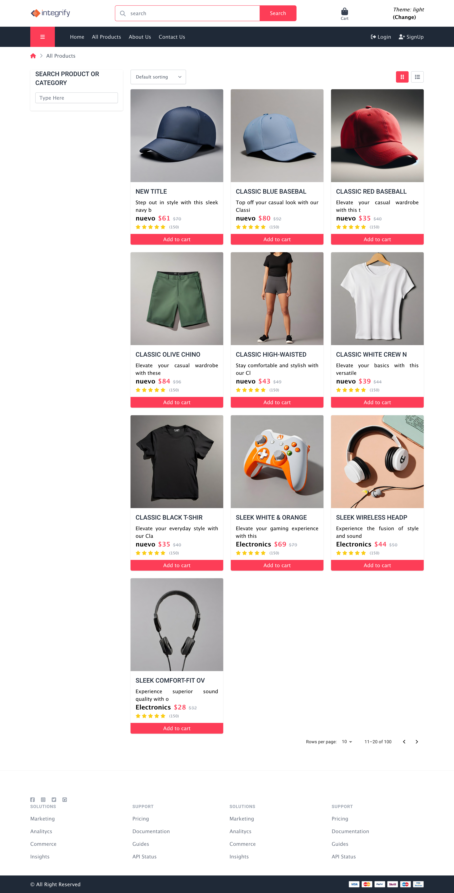
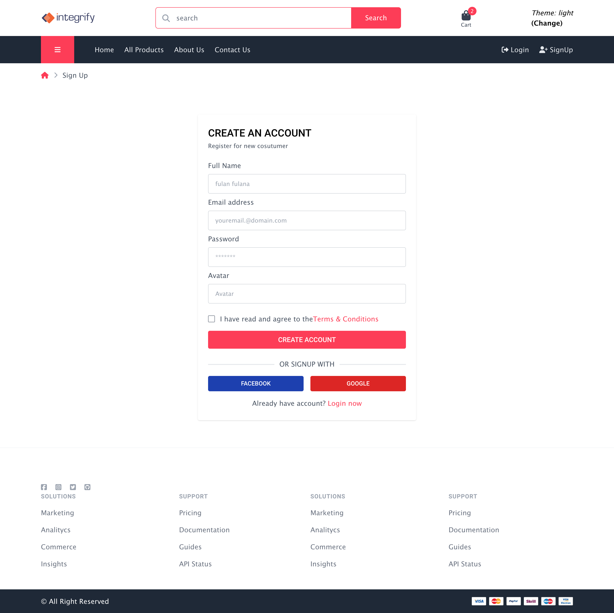
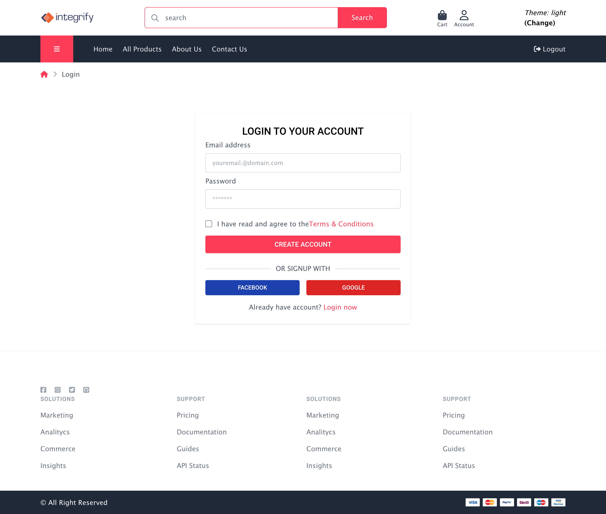
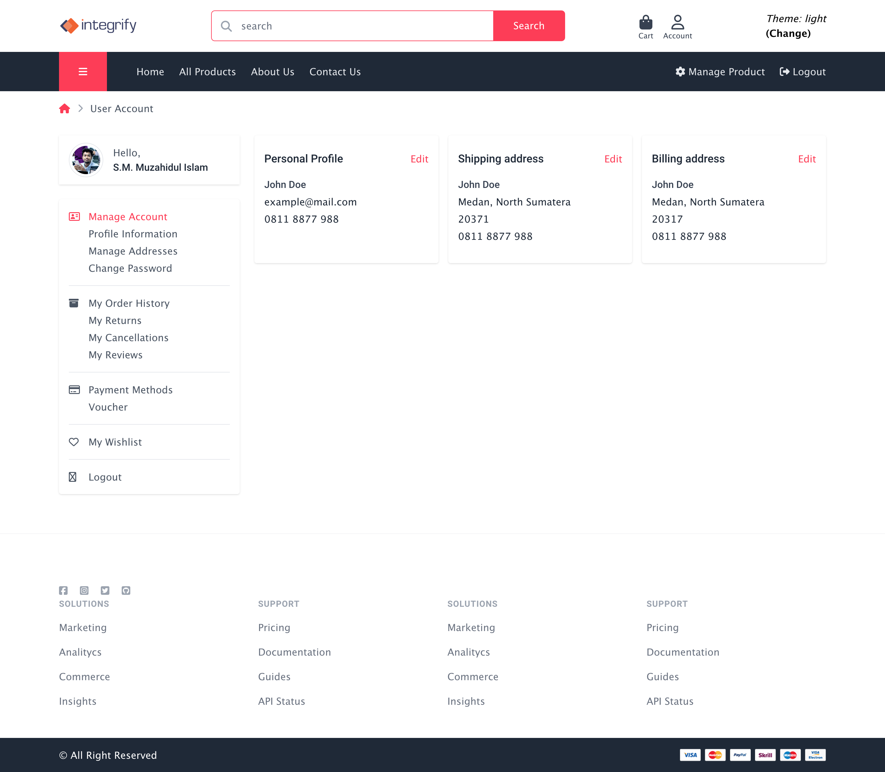
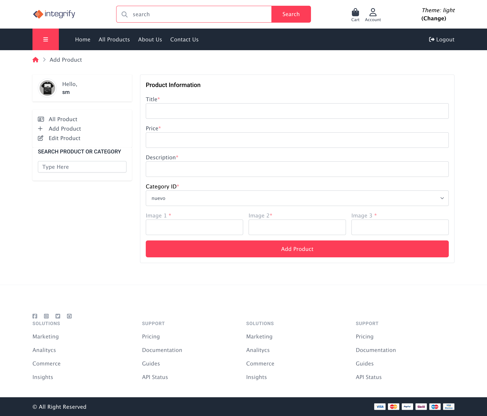
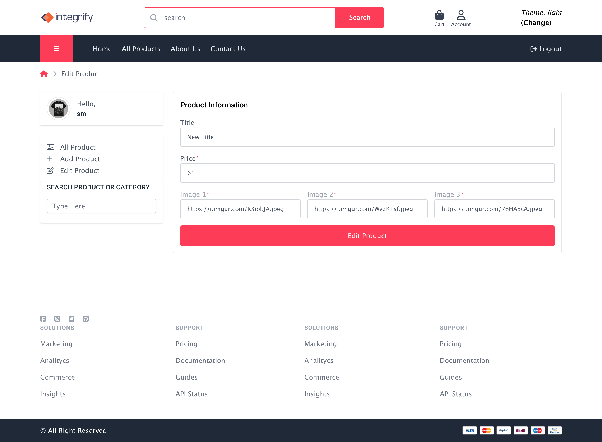
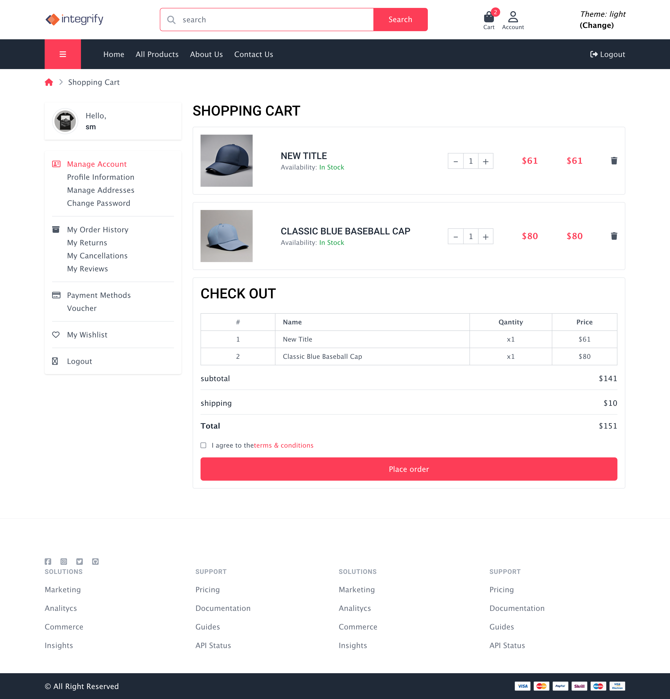
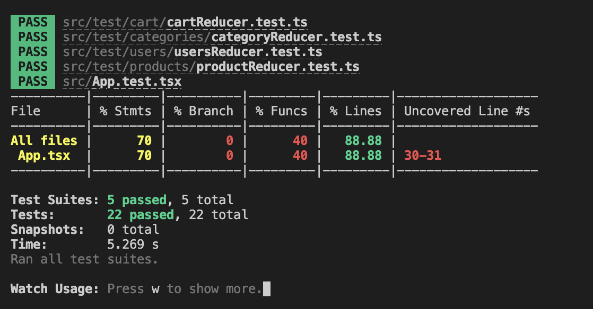

<p align="center">
  
</p>
<p align="center">
    <h1 align="center">fs17-Frontend-project E-Commerce Project</h1>
</p>
<p align="center"> <em>Developed with the software and tools below.</em>
</p>
<p align="center">


</p>

# Frontend project

This project is developed using ReactJS, TypeScript, React Router Dom, Redux Toolkit, Tailwind CSS following a structured architecture that includes components, hooks, screens and unit testing. The main purpose of this project is to create a e-commerce website where customers can easily explore, choose and purchase products online. Context API is utilized for switching between light and dark themes, enhancing user experience and accessibility.

## 🌏 Live-Url

- https://kaleidoscopic-moxie-cfbb6b.netlify.app/

## 📷 App Screenshots










## 📍 API Reference

For the development of this project, we have used the [Platzi API](https://fakeapi.platzi.com/) as a key API reference.

## 🚀 Getting Started

### ⚙️ Install

1. Clone the repository:

```sh
git clone https://github.com/muzahidswe/fs17-Frontend-project.git
```

2. Change to the project directory:

```sh
cd fs17-Frontend-project
```

3. Install the dependencies:

```sh
npm install
```

### ► Run Project

Use the following command to run:

```sh
npm start
```

### 🧪 Unit Testing using JEST

Use the following command to run tests:

```sh
npm test or npx jest
```

Tests for this project are written using Jest, with the assistance of [msw](https://mswjs.io/) for mocking the server. The project utilizes three mock servers for handling products, categories, and users respectively. The tests are structured to cover various aspects of the application's functionality, including unit tests.



---
## 📂 Folder Structure

```sh
fs17-Frontend-project
├-- node_modules
│
├-- public
│   ├-- favicon.ico
│   ├-- index.html
│   └-- manifest.json
│
└-- src
│   |-- assets
|   |   |-- css
|   |   |-- images
|   |   |-- js
│   |-- components
│   |-- contexts
│   |-- misc
│   |-- pages
│   |-- redux
|   |   |-- slices
|   |   |-- store
│   |-- routes
│   |-- test
|   |   |-- cart
|   |   |-- categories
|   |   |-- products
|   |   |-- user
│   |-- utils
│   ├-- App.css
│   ├-- App.js
│   ├-- App.test.js
│   ├-- index.css
│   ├-- index.js
│   ├-- logo.svg
│   └-- setupTests.js
│   └-- theme.js
│
├-- .gitignore
├-- jest.config.js
├-- package-lock.json
├-- package.json
├-- README.md
├-- tsconfig.json

```
---